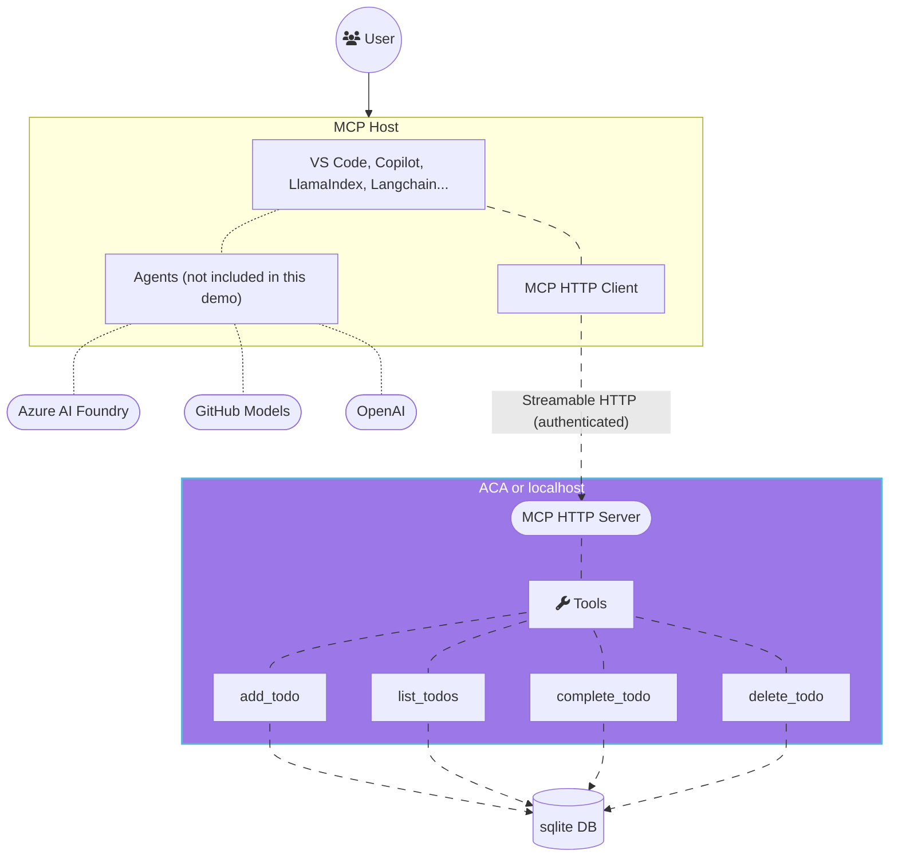
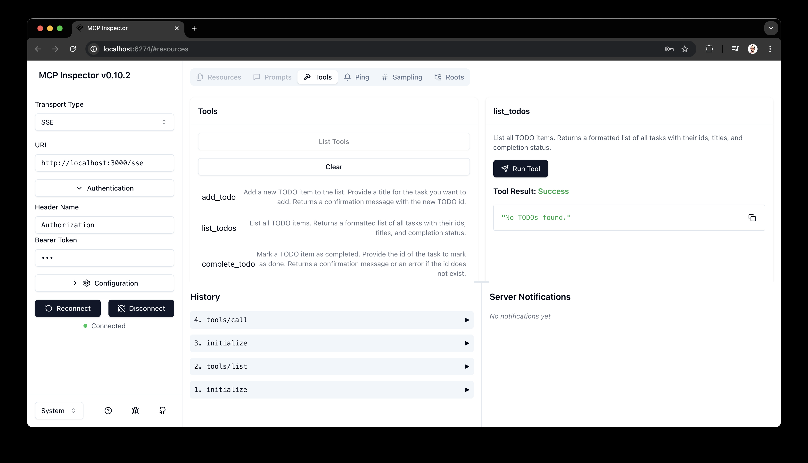

<!--
---
name: Remote MCP with Azure Container Apps (Node.js/TypeScript/JavaScript)
description: Run a remote node.js MCP server on Azure Container Apps.  
languages:
- typescript
- javascript
- nodejs
- bicep
- azdeveloper
products:
- azure-container-apps
- azure
page_type: sample
urlFragment: mcp-container-ts
---
-->
# Getting Started with Remote MCP Servers using Azure Container Apps (Node.js/TypeScript)

<div align="center">

[](https://discord.gg/NcwHpz6bRW)
[](https://aka.ms/foundry/forum)
<br>
[](https://codespaces.new/Azure-Samples/mcp-container-ts?hide_repo_select=true&ref=main&quickstart=true)
[](https://vscode.dev/redirect?url=vscode://ms-vscode-remote.remote-containers/cloneInVolume?url=https://github.com/Azure-Samples/mcp-container-ts)

[](https://www.typescriptlang.org)
[](LICENSE.md)

:star: To stay updated and get notified about changes, star this repo on GitHub!

[](https://github.com/Azure-Samples/mcp-container-ts)  

</div>


This is a quick start guide that provides the basic building blocks to set up a remote Model Context Protocol (MCP) server using Azure Container Apps. The MCP server is built using Node.js and TypeScript, and it can be used to run various tools and services in a serverless environment.


## What is MCP?
The Model Context Protocol (MCP) is a protocol that allows different AI models and tools to communicate with each other. It provides a standardized way for models to share information and collaborate on tasks. The MCP server acts as a bridge between different models and tools, allowing them to work together seamlessly.

Below is the architecture diagram for a typical MCP server setup:



## Prerequisites

1. Install the latest version of [VS Code](https://code.visualstudio.com/)
2. Install [GitHub Copilot](https://marketplace.visualstudio.com/items?itemName=GitHub.copilot) and [GitHub Copilot Chat](https://marketplace.visualstudio.com/items?itemName=GitHub.copilot-chat) extensions

## Running the MCP Server Locally

If you prefer to run the MCP server locally, you can do so by following these steps.

You need to have the following tools installed on your local machine:
- [git](https://git-scm.com/downloads) necessary to clone the repository.
- [Node.js](https://nodejs.org/en/download/) and npm.

Once you have the prerequisites installed, you can follow these steps to run the MCP server locally:

1. Clone this repository:

```bash
git clone https://github.com/Azure-Samples/mcp-container-ts
cd mcp-container-ts
```

2. Install project dependencies

```bash
npm install
```

3. Generate a new JWT configuration:

```bash
npm run generate-token
```

This will append (or create) a new JWT configuration to `.env` file at the root of the project. The generated token will be used to authenticate requests to the MCP server.

> [!NOTE]
> In a production environment, you should use a more secure method to manage your secrets and tokens.

4. Start the dev server

```bash
npm run dev
```

You should see the following output in the terminal:

```bash
  mcp:db 2025-07-23T16:48:05.381Z PRAGMA journal_mode = WAL +0ms
  mcp:db 2025-07-23T16:48:05.382Z CREATE TABLE IF NOT EXISTS todos (
  mcp:db      id INTEGER PRIMARY KEY AUTOINCREMENT,
  mcp:db      text TEXT NOT NULL,
  mcp:db      completed INTEGER NOT NULL DEFAULT 0
  mcp:db    ) +0ms
  mcp:db 2025-07-23T16:48:05.382Z Database "todos" initialized. +0ms
  mcp:index 2025-07-23T16:48:05.449Z MCP Stateless Streamable HTTP Server +0ms
  mcp:index 2025-07-23T16:48:05.449Z MCP endpoint: http://localhost:3000/mcp +0ms
  mcp:index 2025-07-23T16:48:05.449Z Press Ctrl+C to stop the server +0ms
```

4. To access and use the MCP server, read the [Test your MCP server with desktop MCP Clients](#test-your-mcp-server-with-desktop-mcp-clients) section below.

<br>

> [!NOTE]
> When the applications starts, the server will create an [in-memory SQLite](https://www.sqlite.org/inmemorydb.html) database. This database is used to store the state of the tools and their interactions with the MCP server.


## Deploying the MCP Server to Azure Container Apps

To deploy the MCP server to Azure Container Apps, you can use the Azure Developer CLI (azd). This will allow you to provision and deploy the project to Azure with minimal effort:

- Install the [Azure Developer CLI](https://learn.microsoft.com/azure/developer/azure-developer-cli/install-azd).

Once you have the prerequisites installed, you can follow these steps to deploy the MCP server to Azure Container Apps:

1. Clone this repository

```bash
git clone https://github.com/azure-samples/mcp-container-ts.git
cd mcp-container-ts
```

2. Log in to your Azure account

```bash
azd auth login
```

For GitHub Codespaces users, if the previous command fails, try:

```bash
azd auth login --use-device-code
```

1. Provision and deploy the project (ensure you are in the folder of the cloned repo when running this command):

```bash
azd up
```

4. Once the deployment is complete, you can access the MCP server using the URL provided in the output. The URL will look something like this:

```bash
https://<env-name>.<container-id>.<region>.azurecontainerapps.io
```

5. To access and use the MCP server, read the [Test your MCP server with desktop MCP Clients](#test-your-mcp-server-with-desktop-mcp-clients) section below.


> [!NOTE]
> If you were simply testing the deployment, you can remove and clean up all deployed resources by running the following command to avoid incurring any costs:
> ```bash
> azd down --purge --force
> ```


## Other installation options

You have a few other options to get started with this template. The quickest way to get started is GitHub Codespaces, since it will setup all the tools for you and you can run the MCP server in the browser.

### GitHub Codespaces

You can run this template virtually by using GitHub Codespaces. The button will open a web-based VS Code instance in your browser:

1. Open the template (this may take several minutes):

    [](https://codespaces.new/Azure-Samples/mcp-container-ts)

2. Open a terminal window
3. Continue with the next steps to either run the MCP server locally or deploy it to Azure Container Apps.

> [!NOTE]
> If you run the mcp server inside of GitHub Codespaces, make sure to change the port visibility to Public:
> Click on "PORTS" tabs → right-click on the opened port (3000 by default) → Port visibility → Public.

### VS Code Dev Containers

A related option is VS Code Dev Containers, which will open the project in your local VS Code using the [Dev Containers extension](https://marketplace.visualstudio.com/items?itemName=ms-vscode-remote.remote-containers):

1. Install [Docker Desktop](https://www.docker.com/products/docker-desktop) and [VS Code Dev Containers extension](https://marketplace.visualstudio.com/items?itemName=ms-vscode-remote.remote-containers) if not already installed.
2. Start Docker Desktop (install it if not already installed)
3. Open the project:

    [](https://vscode.dev/redirect?url=vscode://ms-vscode-remote.remote-containers/cloneInVolume?url=https://github.com/Azure-Samples/mcp-container-ts)

4. Open a terminal window
5. Continue with the next steps to either run the MCP server locally or deploy it to Azure Container Apps.

## Test your MCP server with desktop MCP Clients

### Option 1 - Use the mcp.json file in VS Code

The quickest way to connect to the MCP server is the use the provided `.vscode/mcp.json` configuration file to set up the MCP server in your VS Code environment. This configuration file contains the necessary settings for the MCP server, including the URL and transport type.

```json
{
  "inputs": [
    {
      "password": true,
      "id": "mcp-server-token",
      "description": "Enter the token for the MCP server",
      "type": "promptString",
    }
  ],
  "servers": {
    "mcp-server": {
      "type": "http",
      "url": "http://localhost:3000/mcp",
      "headers": {
        "Authorization": "Bearer ${input:mcp-server-token}"
      }
    },
    "mcp-server-remote": {
      "type": "http",
      "url": "https://<env-name>.<container-id>.<region>.azurecontainerapps.io/mcp",
      "headers": {
        "Authorization": "Bearer ${input:mcp-server-token}"
      }
    }
  }
}
```

Once you have this file opened, you can click on the "start" inlined action button that will connect the MCP server and fetch the available tools.

**IMPORTANT:** Because the server is secured with a JWT token, you will be prompted by VS Code to enter the token. You need to copy the value of the `"JWT_TOKEN"` from the `.env` file created by the `npm run generate-token` command.

> [!NOTE]
> In a real world scenario, you would want to validate the token and use a more secure method of authentication. This is just a demo token for testing purposes. Learn more about to secure your server [here](https://learn.microsoft.com/entra/identity-platform/authentication-vs-authorization).


### Option 2 - Manually Adding MCP Server to VS Code

1. Add MCP Server from command palette and add URL to your running server's HTTP endpoint:

For local development, the URL will be:
```bash
http://localhost:3000/mcp
```

For Azure Container Apps, the URL will be:
```bash
https://<env-name>.<container-id>.<region>.azurecontainerapps.io/mcp
```

1. Select **HTTP (HTTP or Server-Sent Events)** for the type of MCP server to add.
2. Enter the URL to your running HTTP endpoint, including the `/mcp` path at the end.
3. Enter the server ID. (This can be any name you want)
4. Choose if you want to run this in your User settings (available to all apps for you) or to your Workspace settings (available to this app, only)
5. In Copilot chat agent mode enter a prompt to trigger the tool, e.g., select some code and enter this prompt

```bash
I need to send an email to Dan, please add that to my todo list.
```
7. When prompted to run the tool, consent by clicking Continue,
8. When you're done, press Ctrl+C in the terminal window to stop the func.exe host process, and List MCP Servers from command palette and stop the local server.


### Option 3 - MCP Inspector

1. In a new terminal window, install and run [MCP Inspector](https://modelcontextprotocol.io/docs/tools/inspector)

```bash
npm run inspect
```

1. CTRL click to load the MCP Inspector web app from the URL displayed in the terminal (e.g. http://localhost:6274/?MCP_PROXY_AUTH_TOKEN=xyz)
2. Set the transport type to `Streamable HTTP`.
3. Add authentication header: `Authorization` and Bearer token which is the value of the `"JWT_TOKEN"` from the `.env` file created by the `npm run generate-token` command.
4. Set the URL to your running server's HTTP endpoint and Connect:
```bash
# for local development, use:
http://localhost:3000/mcp

# or use the Azure Container Apps URL:
https://<env-name>.<container-id>.<region>.azurecontainerapps.io/mcp
```
5. List Tools. Click on a tool and Run Tool.



## Next Steps

- Learn more about [Model Context Protocol](https://modelcontextprotocol.io/)
- Learn more about [Azure Container Apps](https://learn.microsoft.com/en-us/azure/container-apps/)
- Learn more about [Azure AI Foundry](https://ai.azure.com)
- Learn more about [related MCP efforts from Microsoft](https://github.com/microsoft/mcp)

## Join the Community

We encourage you to join our Azure AI Foundry Developer Community​ to share your experiences, ask questions, and get support:

- [aka.ms/foundry/discord​](https://discord.gg/NcwHpz6bRW) - Join our Discord community for real-time discussions and support.
- [aka.ms/foundry/forum](https://aka.ms/foundry/forum) - Visit our Azure AI Foundry Developer Forum to ask questions and share your knowledge.