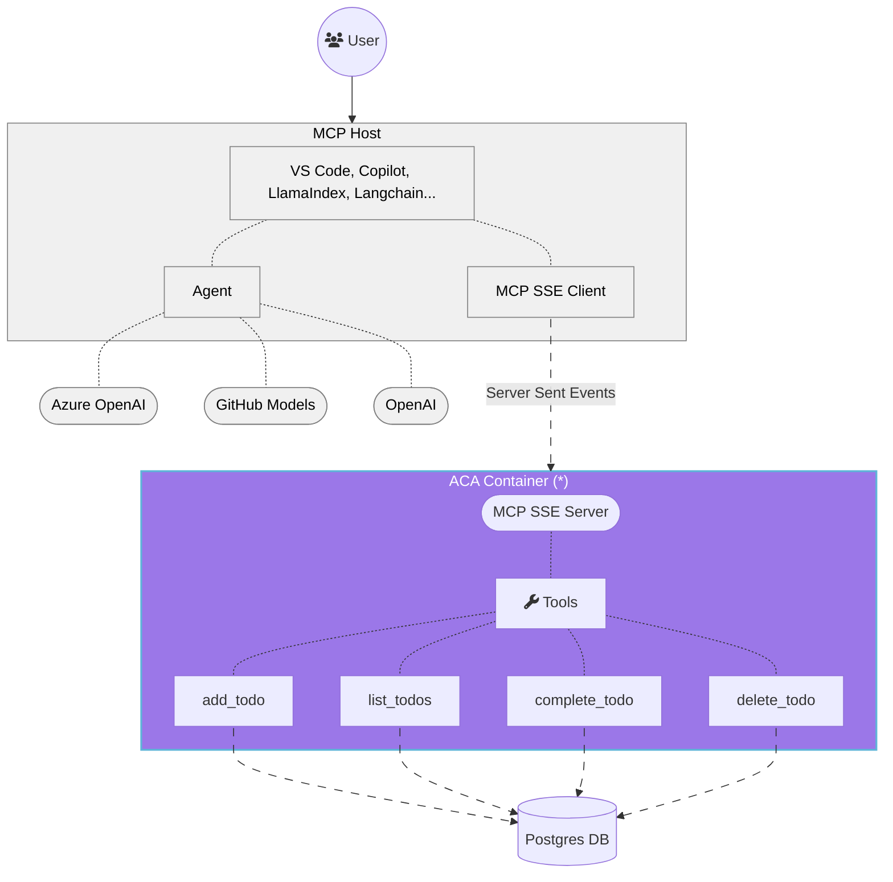

<!--
---
name: Remote MCP with Azure Container Apps (Node.js/TypeScript/JavaScript)
description: Run a remote MCP server on Azure Container Apps.  
languages:
- typescript
- javascript
- nodejs
- bicep
- azdeveloper
products:
- container-apps
- azure
page_type: sample
urlFragment: mcp-container-ts
---
-->
# Getting Started with Remote MCP Servers using Azure Container Apps (Node.js/TypeScript)

This is a quick start guide that provides the basic building blocks to set up a remote Model Context Protocol (MCP) server using Azure Container Apps. The MCP server is built using Node.js and TypeScript, and it can be used to run various tools and services in a serverless environment.

<p align="center">
  
</p>

## What is MCP?
The Model Context Protocol (MCP) is a protocol that allows different AI models and tools to communicate with each other. It provides a standardized way for models to share information and collaborate on tasks. The MCP server acts as a bridge between different models and tools, allowing them to work together seamlessly.

Below is the architecture diagram for a typical MCP server setup:




> [!IMPORTANT]
> (*) This guide implements only the MCP server and Postgres database. The MCP host and clients are not provided. If you are looking for a complete solution, with an MCP host, client and both HTTP and SSE MCP servers please check out this other [repository](https://github.com/manekinekko/azure-container-apps-ai-mcp).

## Getting Started

To get started with this project, follow the steps below:

## Prerequisites

- [Node.js](https://nodejs.org/en/download/) (version 23 or higher) and npm 
- [Docker](https://docs.docker.com/get-started/get-docker/) (recommended for running the MCP servers, and Postgres in Docker)

## Prepare your local environment

A Postgres database is needed to store the TODO items. You can run Postgres in a Docker container or use an existing Postgres database. If you want to run it in a Docker container, you can use the following command:

```bash
docker compose up -d --build 'postgres'                                                                 
```

This will create a Docker container with Postgres running on port 5432. The MCP server will connect to this database to store the TODO items.

Once the container is created and started, you should see the following output:

```bash
[+] Running 2/2
 ✔ Network mcp-container-ts_default        Created             0.0s 
 ✔ Container mcp-container-ts-postgres-1   Started             0.2s    
```

## Run your MCP Server locally from the terminal

1. Clone this repository.
2. Install dependencies

```bash
npm install
```

3. Start the server

```bash
npm start
```

## Use the local MCP server from within a desktop MCP Client

### Option 1 - Use the mcp.json file in VS Code

The quickest way to connect to the MCP server is the use the provided [mcp.json](.vscode/mcp.json) configuration file to set up the MCP server in your VS Code environment. This configuration file contains the necessary settings for the MCP server, including the URL and transport type.
```json
{
  "servers": {
    "mcp-server-sse": {
      "type": "sse",
      "url": "http://localhost:3000/sse"
    }
  }
}
```

Once you have this file opened, you can click on the "start" inlined action button that will connect the MCP server and fetch the available tools.


### Option 2 - Manually Adding MCP Server to VS Code

1. Add MCP Server from command palette and add URL to your running Function app's SSE endpoint:

```bash
http://localhost:3000/sse
```

2. Select HTTP (Server-Sent-Events) for the type of MCP server to add.
3. Enter the URL to your running function app's SSE endpoint
4. Enter the server ID. (This can be any name you want)
5. Choose if you want to run this in your User settings (available to all apps for you) or to your Workspace settings (available to this app, only)
6. In Copilot chat agent mode enter a prompt to trigger the tool, e.g., select some code and enter this prompt

```bash
I need to send an email to Dan, please add that to my todo list.
```
7. When prompted to run the tool, consent by clicking Continue,
8. When you're done, press Ctrl+C in the terminal window to stop the func.exe host process, and List MCP Servers from command palette and stop the local server.


### Option 3 - MCP Inspector

1. In a new terminal window, install and run [MCP Inspector](https://modelcontextprotocol.io/docs/tools/inspector)

```bash
npx -y @modelcontextprotocol/inspector@latest node build/index.js
```

2. CTRL click to load the MCP Inspector web app from the URL displayed by the app (e.g. http://0.0.0.0:5173/#resources)
3. Set the transport type to SSE
4. Set the URL to your running Function app's SSE endpoint and Connect:
```bash
http://localhost:3000/sse
```
5. List Tools. Click on a tool and Run Tool.

## Deploy to Azure Container Apps

TODO

## Next Steps

- Learn more about [related MCP efforts from Microsoft](https://github.com/microsoft/mcp)