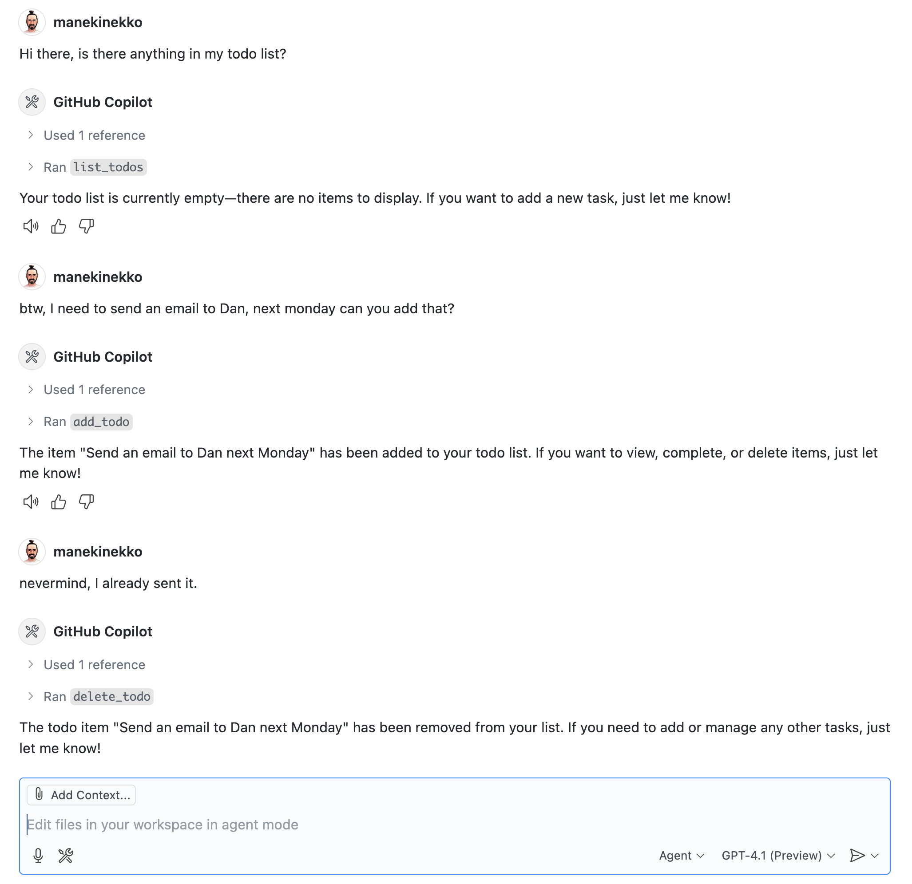
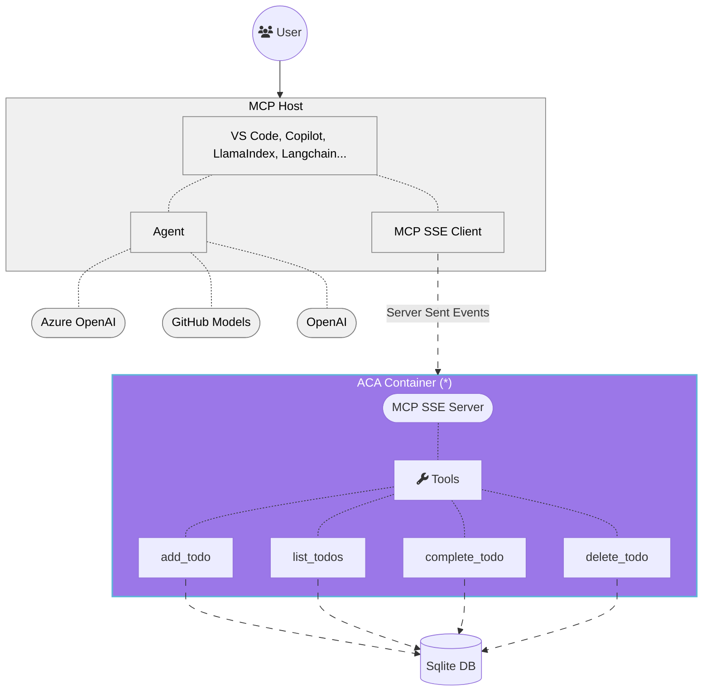

<!--
---
name: Remote MCP with Azure Container Apps (Node.js/TypeScript/JavaScript)
description: Run a remote node.js MCP server on Azure Container Apps.  
languages:
- typescript
- javascript
- nodejs
- bicep
- azdeveloper
products:
- container-apps
- azure
page_type: sample
urlFragment: mcp-container-ts
---
-->
# Getting Started with Remote MCP Servers using Azure Container Apps (Node.js/TypeScript)

This is a quick start guide that provides the basic building blocks to set up a remote Model Context Protocol (MCP) server using Azure Container Apps. The MCP server is built using Node.js and TypeScript, and it can be used to run various tools and services in a serverless environment.

<p align="center">
  
</p>

## What is MCP?
The Model Context Protocol (MCP) is a protocol that allows different AI models and tools to communicate with each other. It provides a standardized way for models to share information and collaborate on tasks. The MCP server acts as a bridge between different models and tools, allowing them to work together seamlessly.

Below is the architecture diagram for a typical MCP server setup:




> [!IMPORTANT]
> (*) This guide implements only the SSE MCP server. The MCP host and clients are not provided. If you are looking for a complete solution, with a custom MCP host, client and both HTTP and SSE MCP servers please check out this other [repository](https://github.com/manekinekko/azure-container-apps-ai-mcp).

## Getting started

You have a few options for getting started with this template.
The quickest way to get started is GitHub Codespaces, since it will setup all the tools for you, but you can also [set it up locally](#local-environment).

### GitHub Codespaces

You can run this template virtually by using GitHub Codespaces. The button will open a web-based VS Code instance in your browser:

1. Open the template (this may take several minutes):

    [](https://codespaces.new/Azure-Samples/mcp-container-ts)

2. Open a terminal window
3. Continue with the [deploying steps](#deploying)

### VS Code Dev Containers

A related option is VS Code Dev Containers, which will open the project in your local VS Code using the [Dev Containers extension](https://marketplace.visualstudio.com/items?itemName=ms-vscode-remote.remote-containers):

1. Start Docker Desktop (install it if not already installed)
2. Open the project:

    [](https://vscode.dev/redirect?url=vscode://ms-vscode-remote.remote-containers/cloneInVolume?url=https://github.com/Azure-Samples/mcp-container-ts)

3. Open a terminal window
4. Start the server

```bash
npm start
```

### Local Environment

If you prefer to run the MCP server locally, you can do so by following these steps:

#### Prerequisites

You need to have the following tools installed on your local machine:
- [Node.js](https://nodejs.org/en/download/) (version 23 or higher) and npm 
- [Docker](https://docs.docker.com/get-started/get-docker/) (recommended for running the MCP server)


1. Clone this repository:

```bash
git clone https://github.com/Azure-Samples/mcp-container-ts
cd mcp-container-ts
```

2. Open the project folder

2. Install dependencies

```bash
npm install
```

3. Start the server

```bash
npm start
```

> [!NOTE]
> When the applications starts, the server will create an [in-memory SQLite](https://www.sqlite.org/inmemorydb.html) database. This database is used to store the state of the tools and their interactions with the MCP server.

## Test your MCP server with desktop MCP Clients

### Option 1 - Use the mcp.json file in VS Code

The quickest way to connect to the MCP server is the use the provided [mcp.json](.vscode/mcp.json) configuration file to set up the MCP server in your VS Code environment. This configuration file contains the necessary settings for the MCP server, including the URL and transport type.

```json
{
  "servers": {
    "mcp-server-sse": {
      "type": "sse",
      "url": "http://localhost:3000/sse"
    }
  }
}
```

Once you have this file opened, you can click on the "start" inlined action button that will connect the MCP server and fetch the available tools.


### Option 2 - Manually Adding MCP Server to VS Code

1. Add MCP Server from command palette and add URL to your running Function app's SSE endpoint:

```bash
http://localhost:3000/sse
```

2. Select HTTP (Server-Sent-Events) for the type of MCP server to add.
3. Enter the URL to your running function app's SSE endpoint
4. Enter the server ID. (This can be any name you want)
5. Choose if you want to run this in your User settings (available to all apps for you) or to your Workspace settings (available to this app, only)
6. In Copilot chat agent mode enter a prompt to trigger the tool, e.g., select some code and enter this prompt

```bash
I need to send an email to Dan, please add that to my todo list.
```
7. When prompted to run the tool, consent by clicking Continue,
8. When you're done, press Ctrl+C in the terminal window to stop the func.exe host process, and List MCP Servers from command palette and stop the local server.


### Option 3 - MCP Inspector

1. In a new terminal window, install and run [MCP Inspector](https://modelcontextprotocol.io/docs/tools/inspector)

```bash
npm run inspect
```

2. CTRL click to load the MCP Inspector web app from the URL displayed by the app (e.g. http://0.0.0.0:5173/#resources)
3. Set the transport type to SSE
4. Set the URL to your running Function app's SSE endpoint and Connect:
```bash
http://localhost:3000/sse
```
5. List Tools. Click on a tool and Run Tool.

## Deploy to Azure Container Apps

1. Install the [Azure Developer CLI](https://learn.microsoft.com/en-us/azure/developer/azure-developer-cli/install-azd) (azd)

 
2. Log in to your Azure account

```bash
azd auth login
```

3. Provision and deploy the project:
  
```bash 
azd up
```
4. Once the deployment is complete, you can access the MCP server using the URL provided in the output. The URL will look something like this:

```bash
https://<env-name>.<container-id>.<region>.azurecontainerapps.io
```

5. You can configure the MCP server in your local VS Code environment by adding the URL to the `mcp.json` file or manually adding it as described in the previous section:

```json
{
  "servers": {
    "mcp-server-sse-remote": {
      "type": "sse",
      "url": "https://<your-app-name>.<region>.azurecontainerapps.io/sse"
    }
  }
}
```

> [!NOTE]
> The URL for the MCP server will be different for each deployment. Make sure to update the URL in the `mcp.json` file or in your MCP client configuration accordingly.
 

6. If you were simply testing the deployment, you can remove and clean up all deployed resources by running the following command to avoid incurring any costs:

```bash
azd down
```

## Next Steps

- Learn more about [related MCP efforts from Microsoft](https://github.com/microsoft/mcp)